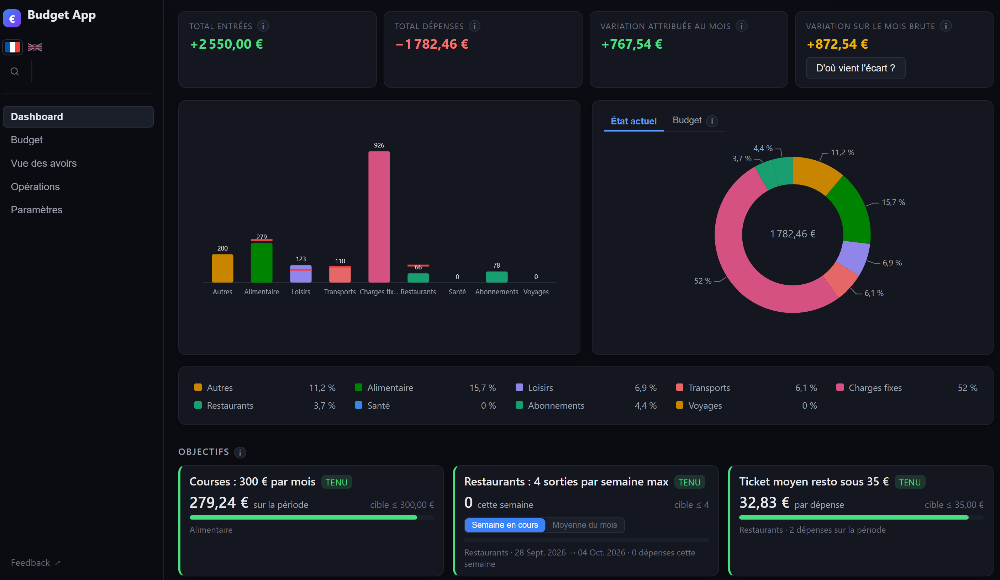

# Budget App

## Qu'est-ce que cette app ?

Une app de budget qui permet de regrouper tous tes comptes au même endroit et de visualiser comment ton argent est réparti.

Tu contrôles les données de tes dépenses : ce que tu veux catégoriser et comment, la période que tu veux regarder, les objectifs que tu te fixes, et la façon dont tu classes tes opérations (imprévue, remboursable, remboursement, amortie sur une durée, prévisionnelle, etc.).

Le tout en automatisant : la première fois, tu expliques à l'app comment interpréter ce qu'elle voit. À partir de la seconde fois, elle le fait toute seule.
L'app se divise en deux parties : l'app de base et les extensions. Elle est volontairement minimaliste, pour que tu puisses la découvrir sans être submergé, puis la personnaliser en choisissant les extensions qui te sont utiles.

Je n'en dis pas plus, tu découvriras par toi-même.



## Trois points importants

- **Tout reste en local.** L'app vit entièrement sur ton ordinateur, sans envoyer tes données et sans connexion à internet, à deux exceptions près : une extension que tu actives pour lire des cours boursiers, et le bouton de feedback.
- **Elle est et restera gratuite.**
- **Elle a été entièrement conçue avec Claude Code.** Si cela te dérange, je préfère que tu le saches avant de l'installer.

## Installation

Télécharge l'application depuis la section **Assets** de la [page Releases](https://github.com/Lunebleue8932/budget-app/releases/latest).
Va chercher l'archive de ton système, décompresse-la quelque part où tu as le droit d'écrire, et lance **Budget App**.

| Système | Archive | À savoir |
|---|---|---|
| **Windows** | `budget-app-windows.zip` | Rien à installer. Voir « Tutoriel Windows » ci-dessous. |
| **macOS** (puce Apple) | `budget-app-macos-arm64.zip` | Mac M1 ou plus récent. Voir « Ouvrir l'app sur macOS » ci-dessous. |
| **macOS** (Intel) | `budget-app-macos-x64.zip` | Mac à processeur Intel. Voir « Ouvrir l'app sur macOS » ci-dessous. |
| **Linux** | `budget-app-linux.zip` | Un paquet à installer d'abord, le moteur d'affichage WebKit2GTK : [Linux](desktop/platforms/linux/README.md). Distribution de 2022 ou plus récente (glibc 2.35 : Ubuntu 22.04, Debian 12, Mint 21, Fedora 36…). |

**Quelle archive macOS ?** Menu  > *À propos de ce Mac*. Si la ligne dit « Puce Apple M… », prends `arm64` ; si elle dit « Processeur Intel », prends `x64`. Se tromper donne une application que macOS refuse d'ouvrir.

**Évite `Program Files`** (et `/Applications` sur macOS) : l'application crée sa
base de données à côté d'elle-même, et ces dossiers sont protégés en écriture.
Un dossier de tes documents fait très bien l'affaire.

### Pourquoi mon système m'affiche un avertissement ?

Si ton système s'inquiète, c'est normal : l'application **n'est pas signée
numériquement** (car c'est payant $$$). Windows et macOS ne savent donc pas qui a écrit
le programme — ils ne disent pas qu'il est dangereux, ils disent qu'ils ne
peuvent pas le vérifier. Les étapes ci-dessous donnent le geste à faire pour chaque
système.

### Tutoriel Windows

https://github.com/user-attachments/assets/e4c132e3-6904-4927-9655-545ea3a8711a

1. Télécharge `budget-app-windows.zip` depuis la section **Assets** de la page Releases.
2. Fais un clic droit sur le ZIP, puis **Extraire tout**, et choisis un dossier où tu peux écrire (par exemple dans tes Documents).
3. Ouvre le dossier extrait et double-clique sur **Budget App.exe**.
4. Si Windows affiche un écran bleu « Windows a protégé votre ordinateur » : clique sur **Informations complémentaires**, puis sur **Exécuter quand même**.

Ce message n'apparaît qu'au premier lancement.

### Ouvrir l'app sur macOS

Au premier lancement, macOS refuse d'ouvrir l'app. Pour la débloquer, ouvre le **Terminal** et exécute :

```
xattr -cr /chemin_complet_de_l'exécutable
```

Astuce : tape `xattr -cr ` (avec un espace à la fin), puis glisse **Budget App** dans la fenêtre du Terminal. Le chemin se remplit tout seul. Appuie ensuite sur Entrée et relance l'app.

Cette commande retire le marquage que macOS pose sur les fichiers téléchargés. Ne l'utilise que sur des applications dont tu connais la source. Plus de détails : [macOS](desktop/platforms/macos/README.md).

### Les extensions (facultatif)

Elles ne sont **pas livrées avec l'application** : le dossier `extensions/`
arrive vide, à côté de l'exécutable.

L'app fonctionne **hors ligne** : aucune donnée ne quitte ta machine, à deux exceptions près : le bouton de feedback, et l'extension « Lecture de cours », à installer soi-même, qui va lire un cours de bourse ou un taux de change sur la page dont tu colles le lien.

Chacune a sa propre archive sur la page Releases, nommée `extension-<nom>.zip`.
Télécharge-la, décompresse-la dans `extensions/`, puis relance l'application : elle te dira l'avoir trouvée et te proposera de l'allumer.

Attention à décompresser le dossier de l'extension, pas une archive
qui le contiendrait.
L'architecture dans le dossier extensions doit ressembler à ce qui suit - le dossier d'une extension est directement un dossier fille d'"extensions/" :

```
Budget App/
  Budget App.exe        (ou « Budget App.app » sur macOS)
  data/                 ta base de données
  extensions/
    placements/         <- le dossier décompressé, tel quel
```

Une extension trouvée arrive **éteinte** : rien d'elle n'est chargé tant que tu n'as pas coché sa case, au lancement ou dans **Paramètres → Extensions**. La décocher ne supprime aucune donnée.

### Si l'application ne démarre pas

Toute erreur au démarrage est écrite en détail dans `erreur.log`, à côté de la
base de données. Regarde d'abord là, et joins ce fichier si tu me signales le
problème.

**Si l'application refuse de démarrer sous Windows** avec une longue trace
mentionnant `Python.Runtime.dll` : c'est la « marque Internet » que Windows
pose sur les fichiers téléchargés, et que l'Explorateur recopie sur tout ce
qu'il extrait d'une archive. Les versions à partir de la v1.0.4 s'en accommodent
toutes seules. Sur une version antérieure, fais un **clic droit sur le ZIP →
Propriétés → coche « Débloquer »**, *avant* de le décompresser.

## Licence

Le code est visible, il n'est pas libre pour autant. Tous droits réservés : tu peux lire ce dépôt et te servir de l'application pour ton usage personnel, mais aucune autorisation d'exploitation n'est accordée : ni redistribution, ni usage commercial, ni réutilisation du code dans un autre projet.

Le détail est dans le fichier [LICENSE](LICENSE). Si tu as des questions ou une demande particulière, tu peux me les adresser via GitHub.
