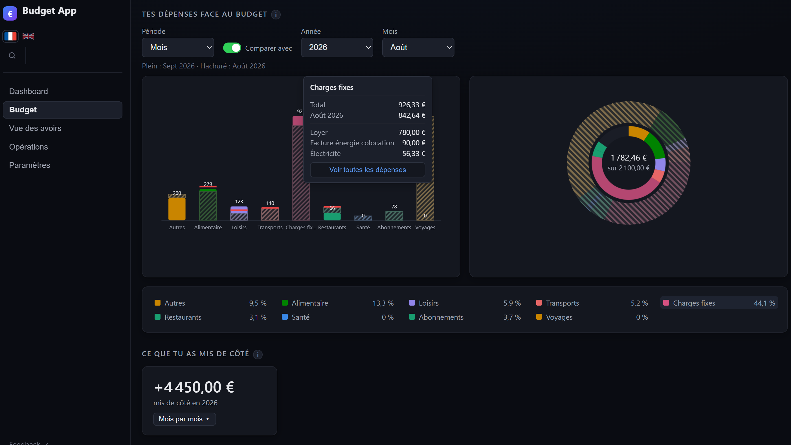
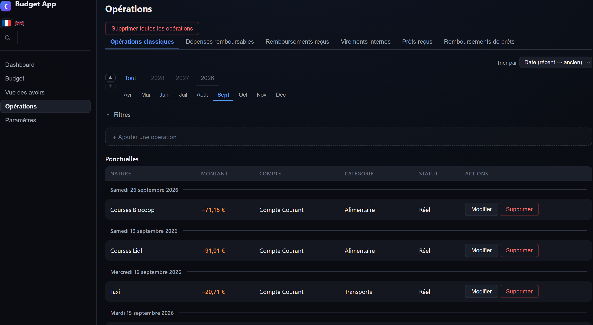

# Budget App

## Qu'est-ce que cette app ?

Une app de budget qui permet de regrouper tous tes comptes au même endroit et de visualiser comment ton argent est réparti.

Tu contrôles les données de tes dépenses : ce que tu veux catégoriser et comment, la période que tu veux regarder, les objectifs que tu te fixes, et la façon dont tu classes tes opérations (imprévue, remboursable, remboursement, amortie sur une durée, prévisionnelle, etc.).

Le tout en automatisant : la première fois, tu expliques à l'app comment interpréter ce qu'elle voit. À partir de la seconde fois, elle le fait toute seule.
L'app se divise en deux parties : l'app de base et les extensions. Elle est volontairement minimaliste, pour que tu puisses la découvrir sans être submergé, puis la personnaliser en choisissant les extensions qui te sont utiles.

Je n'en dis pas plus, tu découvriras par toi-même.

## Trois points importants

- **Tout reste en local.** L'app vit entièrement sur ton ordinateur, sans envoyer tes données et sans connexion à internet, à deux exceptions près : une extension que tu actives pour lire des cours boursiers, et le bouton de feedback.
- **Elle est et restera gratuite.**
- **Elle a été entièrement conçue avec Claude Code.** Si cela te dérange, je préfère que tu le saches avant de l'installer.

## Installation

Télécharge l'application depuis la section Assets de la page [Releases](https://github.com/Lunebleue8932/budget-app/releases). Toutes les informations d'installation y sont regroupées.

> ⚠️ L'app n'est pas signée numériquement : Windows et macOS afficheront un avertissement au premier lancement. Ils ne disent pas qu'elle est dangereuse, ils ne peuvent simplement pas vérifier son auteur. La marche à suivre pour chaque système est sur la page Releases.

## Licence

Le code est visible, il n'est pas libre pour autant. Tous droits réservés : tu peux lire ce dépôt et te servir de l'application pour ton usage personnel, mais aucune autorisation d'exploitation n'est accordée : ni redistribution, ni usage commercial, ni réutilisation du code dans un autre projet.

Le détail est dans le fichier [LICENSE](LICENSE). Si tu as des questions ou une demande particulière, tu peux me les adresser via GitHub.
